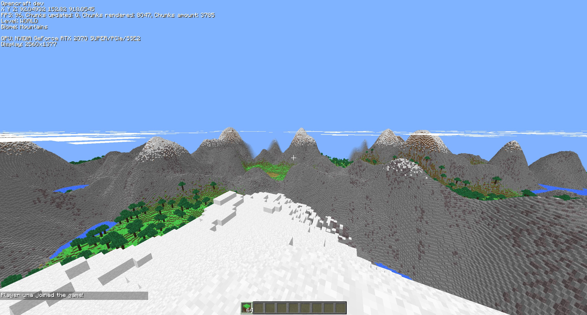

# OpenCraft

  

OpenCraft is an open source cubic game witch is written on Java.

# Why?

Because we want to create a replica of official minecraft client, with simple abilities to edit by community.
With OpenCraft you can write your own Mods, Texture Packs and more without any 3rd party software.
You can add new mobs, items and even new mechanics! You can edit the whole game code, because it's open source.

# Download

We are developing OpenCraft now. You can download and test last beta version [here](https://github.com/Artingl/OpenCraft/releases)

If you found some bug, create an issue. Describe the bug (it will be good if you can provide screenshot)

# TODO

- [ ] Singleplayer
- [ ] Mobs
- [X] Gamemodes
- [X] Biomes
- [X] Dimensions
- [X] Infinity world generation
- [X] Mods Engine
- [ ] Simple Mods API
- [ ] Multiplayer
- [X] Debug system
- [X] Languages

# Screenshots

